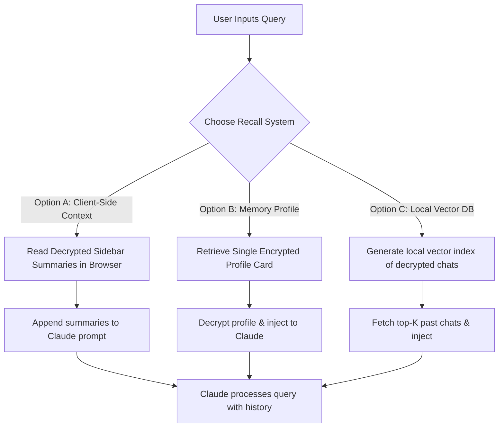

# Feasibility Study: In-Memory past conversation capabilities

Yes, enabling the AI Spiritual Guide to refer to past conversations for a richer, continuous context is **highly feasible**. It would dramatically enhance the pastoral feel of the app, allowing the guide to reference previous struggles, prayer resolutions, or favored saints.

Below are three architectural approaches, ordered by simplicity and security compatibility (since all user data is encrypted with AES-256 in the database).

---

## 1. Architectural Options

### Option A: Client-Side Summary Injection (Recommended)
Since the client already fetches and decrypts past session summaries to populate the sidebar, we can load these summaries into the application's memory during the session.

*   **Mechanism:** When calling `/api/query`, the frontend sends the decrypted summaries of the last $N$ sessions in the request body (e.g., as a `past_sessions_context` parameter). The backend adds these to the Claude system prompt as a "History of the Journey" block.
*   **Pros:**
    *   **Simple & Secure:** No modifications to the database schema. Decryption remains safe on the client, and only the active context is sent to the LLM.
    *   **Low Latency:** Zero additional database queries or vector search steps.
*   **Cons:**
    *   Slightly increases token usage (typically ~100–150 tokens per summary card, meaning ~3,000 tokens for 20 past sessions, which easily fits within Claude's 200k limit).

### Option B: The "Spiritual Profile" (Memory Card)
Instead of injecting whole past summaries, the system maintains a single, growing "Spiritual Profile" document (stored encrypted in a new column on the user's profile or sessions table).

*   **Mechanism:** At the end of a conversation (when generating a summary), we ask Claude to also update a concise profile card (e.g., *“User is focused on developing patience; finds St. Francis de Sales comforting; struggles with morning prayer routine.”*). This profile is decrypted at session startup and injected into every prompt.
*   **Pros:**
    *   **Extremely Token-Efficient:** Always keeps context extremely small.
    *   **Long-Term Consistency:** Captures long-term spiritual growth instead of just recent chat logs.
*   **Cons:**
    *   Requires a database schema addition for the profile text.

### Option C: Client-Side Vector search (In-Browser RAG)
If the goal is to remember specific sentences or discussions from months ago, we can run vector search over past messages.

*   **Mechanism:** When loading the app, all messages are decrypted. The browser generates embeddings for the past messages (using the Gemini Embedding API) and builds an in-memory vector index in Javascript. When the user asks a question, the client does a local cosine similarity check to find relevant messages, then sends them to Claude.
*   **Pros:**
    *   Highly granular memory retrieval.
*   **Cons:**
    *   Slightly higher initialization time as it embeds/indexes messages locally, though this can be cached in browser IndexedDB.

---

## 2. Security & Encryption Impact

Because user conversations in [wisdom-of-the-doctors](file:///root/Documents/agy/wisdom/wisdom-of-the-doctors.html) are encrypted client-side using `crypto.js`, we must protect user privacy:
1.  **No Server-Side Vector Indexing of User Chats:** Storing vector embeddings of user messages on Supabase makes them searchable. Although vectors are numbers, they represent semantic meaning and could theoretically leak conversational content.
2.  **Keep it in Browser Memory / Client-Side Decrypted:** Option A and Option B keep the data encrypted at rest. Decryption happens on the client, and the context is only sent in-flight to Claude via HTTPS.

---

## 3. Recommended Path forward
If we decide to build this, **Option A (Client-Side Summary Injection)** combined with a lightweight **Option B (Spiritual Profile)** would yield the most premium, secure, and contextually rich results with minimal overhead.
